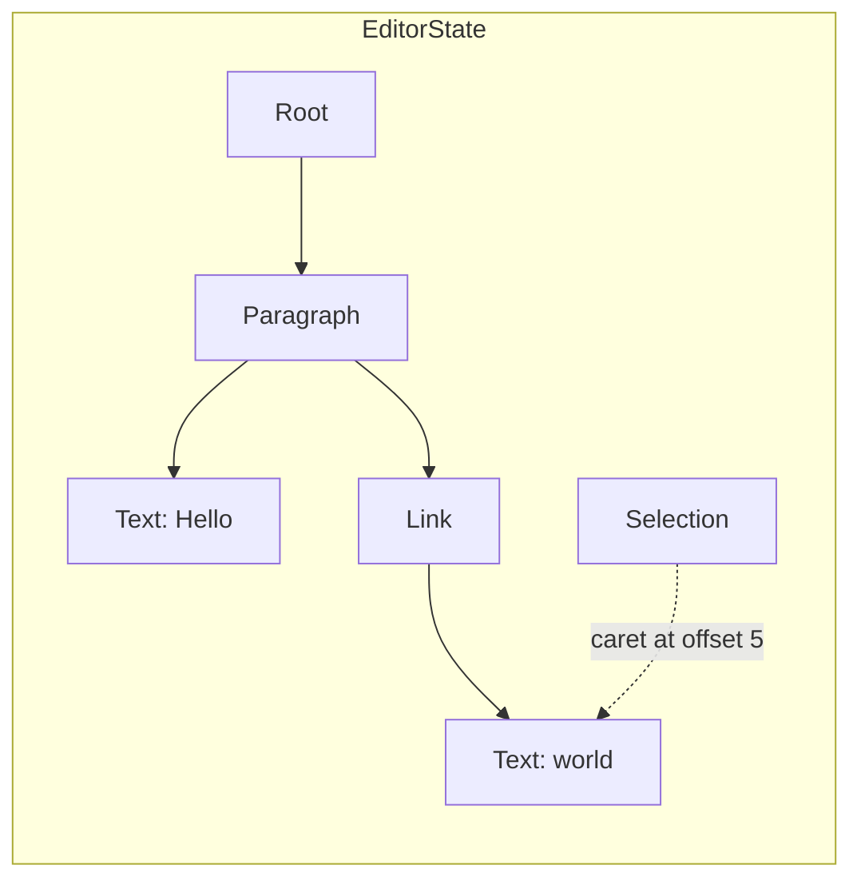
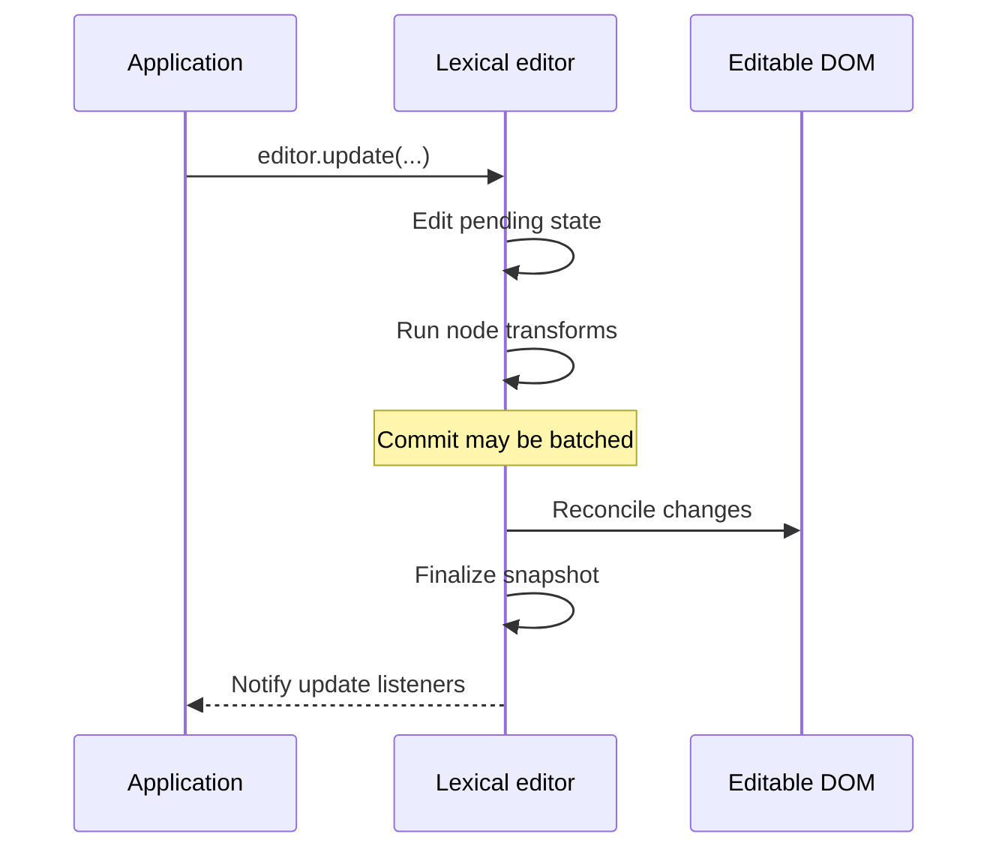

# Introduction

Lexical is a JavaScript framework for building text editors, with a focus on
reliability, accessibility, and performance. Its document model is a DOM-like
tree of nodes that you can navigate, extend, and update. Lexical manages content,
selection, and rendering while you build the interface and choose the features.

In the browser, Lexical connects an editor to a `contenteditable` element and
keeps the DOM in sync with its editor state. It works with or without React.
You can also process documents without a browser using `@lexical/headless`.

## What can you build? {#what-can-be-built-with-lexical}

- Text inputs with mentions, links, or custom emoji.
- Rich text editors for messages, comments, and blog posts.
- Document editors with lists, tables, images, and embedded components.
- Collaborative editors with shared content and remote cursors, using
  [Yjs](collaboration/react.md).

Lexical supplies the editing infrastructure. Your application supplies the
layout, toolbars, menus, styling, and storage. Try the
[playground](https://playground.lexical.dev/) to explore the available features.

Lexical is used in Meta's products and in projects such as
[Ghost's Koenig editor](https://ghost.org/changelog/new-editor/),
[Payload's rich text editor](https://payloadcms.com/docs/rich-text/overview),
[Proton Docs](https://github.com/ProtonMail/WebClients/tree/main/applications/docs-editor),
[Sveltia CMS](https://sveltiacms.app/en/docs/fields/richtext), and
[Dify's prompt editor](https://github.com/langgenius/dify/blob/main/web/app/components/base/prompt-editor/index.tsx).

## Choose your features

The `lexical` package provides the editor, state model, base node types,
selection APIs, and DOM reconciliation. Other packages add features such as
rich text editing, undo/redo, lists, tables, and collaboration.

For new editors, use [extensions](extensions/intro.md) to compose these features.
An extension bundles configuration, nodes, and behavior, and can depend on other
extensions. Lexical resolves those dependencies and manages their registration
and cleanup. For example, adding `CheckListExtension` also includes the list
support it depends on.

Define an application extension that depends on the features you need, then
create the editor with `buildEditorFromExtensions` from `@lexical/extension`, or
use [`LexicalExtensionComposer`](extensions/react.md) in React. The same extension
definitions work in both environments.

## How Lexical works {#lexicals-design}

### A DOM-like document model

Lexical's tree follows the structure of editable content: a paragraph can contain
text and a link, and the link can contain its own text nodes. Nodes have an
identity and expose familiar operations such as `getParent()`, `getNextSibling()`,
`append()`, and `remove()`. This makes working with document structure similar to
working with HTML, while keeping the editor model separate from the browser DOM.

Both Lexical and [ProseMirror](https://prosemirror.net/docs/guide/#doc) use
structured trees and immutable state, but differ in how you address and edit
content:

| Design choice | Lexical | ProseMirror |
| --- | --- | --- |
| Node identity and navigation | Nodes have stable runtime keys and parent, child, and sibling relationships. | Nodes are immutable values without parent links; resolved document positions provide ancestor context. |
| Selection positions | A range endpoint identifies a node and an offset within its text or children. | A position is an integer offset in the document's token sequence, counting text and node boundaries. |
| Inline content | Inline elements such as links contain child nodes. Bold and italic are properties of text nodes. | Inline content is typically a flat sequence of nodes with marks for formatting and links. |
| Applying edits | Call node and selection methods inside `editor.update()`; Lexical produces a new snapshot. | Build transactions from editing steps, usually addressing document positions or ranges, to produce a new state. |

Lexical's model lets you work directly with a node or subtree without translating
most edits into document-wide offsets. It does not mirror every HTML element:
for example, bold text does not require a separate `<strong>` node. In both
frameworks, the editor state is the source of truth and the DOM is its editable
view.

### Editor instances

A `LexicalEditor` manages the current state, schedules updates, and registers
commands, transforms, and listeners. In the browser, it also manages the editable
DOM element. You can create an editor with extensions or use the lower-level
`createEditor()` API to configure and register its behavior yourself.

### Editor state {#editor-states}

An [`EditorState`](concepts/editor-state.md) contains:

- A tree of [nodes](concepts/nodes.mdx) representing the document, such as
  paragraphs and text.
- A [selection](concepts/selection.md) representing the caret or selected
  content, or `null` when there is no selection.

For example, “Hello world” with a link around “world” and the caret at the end
has this structure:



A committed state is an immutable snapshot, so later edits do not change earlier
snapshots.

`editor.getEditorState()` returns the latest committed snapshot. Its `toJSON()`
method serializes the document content, excluding the selection and runtime node
keys. To restore saved content, parse it with `editor.parseEditorState()` and
apply it with `editor.setEditorState()`. The editor must have the corresponding
node types registered. See [serialization](serialization/serialization.md) for JSON,
HTML, and Markdown import and export.

### Reading and updating state {#reading-and-updating-editor-state}

Use `editor.update()` to change content and `editor.read()` to read it. Both take
synchronous callbacks that establish which editor state the code is working
with. Functions prefixed with `$`, such as `$getRoot()`, and most node methods
must run in this context. Make changes only in an update context.

Given an editor instance, this appends a paragraph and reads the resulting text:

```js
import {$createParagraphNode, $createTextNode, $getRoot} from 'lexical';

editor.update(() => {
  const paragraph = $createParagraphNode();
  paragraph.append($createTextNode('Hello world'));
  $getRoot().append(paragraph);
});

const text = editor.read(() => $getRoot().getTextContent());
```

Here, `editor.read()` commits any pending updates before reading, so it includes
the new paragraph. Use `editor.read('latest', callback)` to read the latest
committed state without flushing pending changes, or `editorState.read(callback)`
to read a particular snapshot.

Keep read and update callbacks synchronous: do asynchronous work first, then
enter a callback to use the result. Avoid nesting updates or calling
`editor.read()` inside an update. Command handlers and node transforms already
run in an update context and can use `$` functions directly. See
[editor state](concepts/editor-state.md) for more on update timing.

### From state to DOM {#dom-reconciler}

During an update, Lexical works on a pending state and runs node transforms.
It can batch multiple updates into one commit. For an editor attached to a DOM
element, committing reconciles the changed nodes and selection with the DOM,
finishes the immutable snapshot, and notifies update listeners.



Lexical tracks which nodes changed so its reconciler can update the relevant
parts of the DOM. Headless editors use the same state and update APIs without
DOM reconciliation.

### Commands, transforms, and listeners {#listeners-node-transforms-and-commands}

These APIs let features cooperate within an editor:

- **[Commands](concepts/commands.md)** represent actions such as inserting text
  or toggling formatting. Dispatch them with `editor.dispatchCommand()` and
  handle them with `editor.registerCommand()`. Handlers run in priority order;
  returning `true` stops propagation.
- **[Node transforms](concepts/transforms.md)** adjust changed nodes during an
  update, before reconciliation. Use them to enforce document rules or derive
  content without scheduling another update from a listener.
- **[Listeners](concepts/listeners.md)** observe editor events. For example,
  `editor.registerUpdateListener()` receives committed states that you can use
  to save content or update application UI.

These registration methods return cleanup functions. When you register behavior
in an extension's `register` callback, return its cleanup function so Lexical can
call it when the editor is disposed.

## Get started

Start with [Lexical Extensions](extensions/intro.md) or
[React and Lexical Extension](extensions/react.md) to build an editor. Then explore
[the included extensions](extensions/included-extensions.md) and the concept
guides linked above as you add features.
